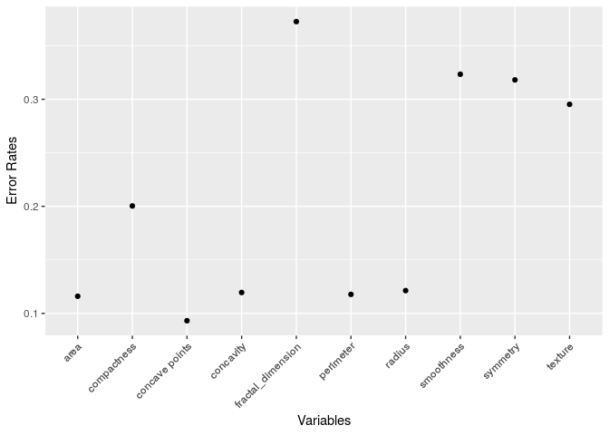

This is a data analysis of the Breast Cancer Wisconsin (Diagnostic) Data Set ^[https://www.kaggle.com/uciml/breast-cancer-wisconsin-data]. This data set describes characteristics of the cell nuclei present in a digitized image. 

We restricted our analysis to every column, except standard error.

Here is the attribute Information:^[https://archive.ics.uci.edu/ml/datasets/Breast+Cancer+Wisconsin+%28Diagnostic%29]:

1) ID number 
2) Diagnosis (M = malignant, B = benign) 

Ten real-valued features are computed for each cell nucleus: 

a) radius (mean of distances from center to points on the perimeter) 
b) texture (standard deviation of gray-scale values) 
c) perimeter 
d) area 
e) smoothness (local variation in radius lengths) 
f) compactness (perimeter^2 / area - 1.0) 
g) concavity (severity of concave portions of the contour) 
h) concave points (number of concave portions of the contour) 
i) symmetry 
j) fractal dimension ("coastline approximation" - 1)


# Regression Analysis

The number of people in each group who had diagnois as 'benign' or 'malignent'
Since response has binary values, 'Malignent'(equaling 1) and 'Benign'(equaling 0). We need to use logistic regression to see the data analysis. First, we ran logistic regression model separately on each of 10 variables.
Next, error rates which gauge the accuracy of our model, can be derived by logistic regression. If fitted value is bigger than 0.5, we predict all of data as 1. Likewise, if fitted value is smaller or equal than 0.5, we predict that the data as 0. 

If the predictions and the data do not match, we consider it as an error. The mean of all cases where two values do not match are called are error rate.


<!-- -->

These are the logistic regressions on all of each variables. The blue line is the continuously predicted model of the data. The dots are the data points. 
As a Remark, the graph using fractal_dimension looks very different from other ones. We can see later also that it has the highest error rate. But if we use other ways to analyze the data, the conclusion has a twist.


<!-- -->


```r
logit_mod<-glm(diagnosis~area+ `concave points`+concavity+perimeter+radius, family = "binomial", data=cancer2)
summary(logit_mod)
```

```
## 
## Call:
## glm(formula = diagnosis ~ area + `concave points` + concavity + 
##     perimeter + radius, family = "binomial", data = cancer2)
## 
## Deviance Residuals: 
##      Min        1Q    Median        3Q       Max  
## -2.41723  -0.24089  -0.12233   0.01557   2.65887  
## 
## Coefficients:
##                  Estimate Std. Error z value Pr(>|z|)    
## (Intercept)       5.73493    7.49853   0.765   0.4444    
## area              0.03341    0.01294   2.583   0.0098 ** 
## `concave points` 83.52433   16.93856   4.931 8.18e-07 ***
## concavity         1.56923    6.25950   0.251   0.8020    
## perimeter        -0.01387    0.25822  -0.054   0.9572    
## radius           -2.12784    2.20132  -0.967   0.3337    
## ---
## Signif. codes:  0 '***' 0.001 '**' 0.01 '*' 0.05 '.' 0.1 ' ' 1
## 
## (Dispersion parameter for binomial family taken to be 1)
## 
##     Null deviance: 751.44  on 568  degrees of freedom
## Residual deviance: 200.34  on 563  degrees of freedom
## AIC: 212.34
## 
## Number of Fisher Scoring iterations: 8
```


```r
pred <- ifelse(predict(logit_mod,type="response")>0.5,1,0)
#table(cancer2$diagnosis,pred)
error_rate=mean(cancer2$diagnosis!=pred)
error_rate
```

```
## [1] 0.07908612
```

If the error rate is bigger than the significant value, we drop such predictor variables. For example, if we only use only 5 out of 10 variables. The error rate is about 8%.

# Variable Selection


```r
fullmod=glm(diagnosis ~ .-id,family="binomial",data=cancer2)
summary(fullmod)
```

```
## 
## Call:
## glm(formula = diagnosis ~ . - id, family = "binomial", data = cancer2)
## 
## Deviance Residuals: 
##      Min        1Q    Median        3Q       Max  
## -1.95590  -0.14839  -0.03943   0.00429   2.91690  
## 
## Coefficients:
##                    Estimate Std. Error z value Pr(>|z|)    
## (Intercept)        -7.35952   12.85259  -0.573   0.5669    
## radius             -2.04930    3.71588  -0.551   0.5813    
## texture             0.38473    0.06454   5.961  2.5e-09 ***
## perimeter          -0.07151    0.50516  -0.142   0.8874    
## area                0.03980    0.01674   2.377   0.0174 *  
## smoothness         76.43227   31.95492   2.392   0.0168 *  
## compactness        -1.46242   20.34249  -0.072   0.9427    
## concavity           8.46870    8.12003   1.043   0.2970    
## `concave points`   66.82176   28.52910   2.342   0.0192 *  
## symmetry           16.27824   10.63059   1.531   0.1257    
## fractal_dimension -68.33703   85.55666  -0.799   0.4244    
## ---
## Signif. codes:  0 '***' 0.001 '**' 0.01 '*' 0.05 '.' 0.1 ' ' 1
## 
## (Dispersion parameter for binomial family taken to be 1)
## 
##     Null deviance: 751.44  on 568  degrees of freedom
## Residual deviance: 146.13  on 558  degrees of freedom
## AIC: 168.13
## 
## Number of Fisher Scoring iterations: 9
```


```r
pred <- ifelse(predict(fullmod,type="response")>0.5,1,0) #table(cancer2$diagnosis,pred) 
error_rate=mean(cancer2$diagnosis!=pred) 
error_rate
```

```
## [1] 0.05096661
```

However, we saw that logistic regression with all variables has lower error rate. 
Therefore, we performed backward elimination of variables to select features. 

We choose a model by sequentially deleting one variable at a time according to a set of rules until a stopping criterion is met.

Step 1: Begin with the full model in all available variables.

Step 2: Remove the variable that has the lowest statistical
significance (smallest F-statistic or largest p-value). Continue
until the stopping rule is satisfied.

Stopping rule: All F values are greater than 3 (or every p-value is less than 0.05).


By the method of Backward Elimination, we dropped two variables `perimeter` and `compactness`.


```r
summary(redmod)
```

```
## 
## Call:
## glm(formula = diagnosis ~ radius + texture + area + smoothness + 
##     concavity + `concave points` + symmetry + fractal_dimension, 
##     family = "binomial", data = cancer2)
## 
## Deviance Residuals: 
##      Min        1Q    Median        3Q       Max  
## -1.96847  -0.15195  -0.04024   0.00409   2.93549  
## 
## Coefficients:
##                    Estimate Std. Error z value Pr(>|z|)    
## (Intercept)        -5.27847   10.31074  -0.512  0.60869    
## radius             -2.68473    1.32326  -2.029  0.04247 *  
## texture             0.38262    0.06413   5.966 2.42e-09 ***
## area                0.04157    0.01554   2.675  0.00747 ** 
## smoothness         78.22119   30.57445   2.558  0.01052 *  
## concavity           8.25689    8.04476   1.026  0.30472    
## `concave points`   64.07659   26.75842   2.395  0.01664 *  
## symmetry           16.02120   10.47671   1.529  0.12621    
## fractal_dimension -82.21451   58.85970  -1.397  0.16248    
## ---
## Signif. codes:  0 '***' 0.001 '**' 0.01 '*' 0.05 '.' 0.1 ' ' 1
## 
## (Dispersion parameter for binomial family taken to be 1)
## 
##     Null deviance: 751.44  on 568  degrees of freedom
## Residual deviance: 146.22  on 560  degrees of freedom
## AIC: 164.22
## 
## Number of Fisher Scoring iterations: 9
```


```r
redpred <- ifelse(predict(redmod,type="response")>0.5,1,0)
#table(cancer2$diagnosis,pred)
error_rate_red=mean(cancer2$diagnosis!=redpred)
error_rate_red
```

```
## [1] 0.05272408
```

<!-- The error rate reduced by (around) 2.7% by adding `texture`, `smoothness`, `symmetry`, `fractal_dimension` and removing `perimeter`. -->
However, we observed that reduced model showed poor performance in prediction and goodness-of-fit than the full model.  

# Other Link 

We used other link functions to find the best model to predict the correct diagnosis of the breast cancer.

We first used all features as predictors. 


| Full model with Link | logit|probit|cloglog|
|:------|:--------|:--------|:--------|
| Error Rates | 0.0509666  | 0.0544815 | 0.0492091|
| Deviance | 146.1304184 | 145.4039643 | 142.9590068 |
| PseudoR2 | 0.8055328 | 0.8064996 | 0.8097533|

Now, we used predictors chosen from the backward elimination. 


| Reduced model with Link | logit|probit|cloglog|
|:------|:--------|:--------|:--------|
| Error Rates | 0.0527241  | 0.0527241 | 0.0544815|
| Deviance | 146.2174161 | 145.6682547 | 143.3191619 |
| PseudoR2 | 0.805417 | 0.8061479 | 0.809274|

# Conclusion

We selected variables radius, texture, area, smoothness, `concave points`, concavity, symmetry, fractal_dimension
to predict if the breast cancer is malignant or benign.  
By the results of error rates for each link, logit or probit gave the more accurate prediction.   
To see the goodness-of-fit for generalized linear models, we further compared deviance residual and psuedo R sqaured. 
Using link cloglog on the variable 'diagnosis' had the smallest deviance residual. 
The largest pseudo R squared was obtained when we used loglog as link.
Therefore, if we focus on the prediction, either logit or probit are the best options. 
But, we will use cloglog to see the variablity of the data (almost 81% of the whole data can be exaplained by the model loglog). 
