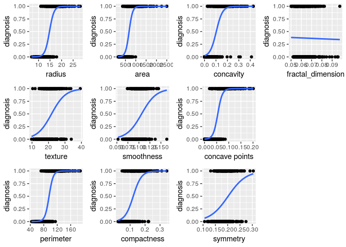

```r
library(tidyr)
library(dplyr)
```

```
## 
## Attaching package: 'dplyr'
```

```
## The following objects are masked from 'package:stats':
## 
##     filter, lag
```

```
## The following objects are masked from 'package:base':
## 
##     intersect, setdiff, setequal, union
```

```r
library(DescTools) 
library(purrr)
library(grid)
library(knitr)
library(ggplot2)
```

```
## Registered S3 methods overwritten by 'ggplot2':
##   method         from 
##   [.quosures     rlang
##   c.quosures     rlang
##   print.quosures rlang
```

```r
source("http://peterhaschke.com/Code/multiplot.R") #load multiplot function
```


<!-- -->


```r
setwd("/cloud/project/Day5/ProjectRelated/final_project/data")
cancer<-read.csv("data.csv", header=FALSE)
```


```r
cancer2<-cancer %>% 
  select(2:13) %>% 
  drop_na() 
```


```r
colnames(cancer2)<-c("id", "diagnosis", "radius", "texture",
                     "perimeter", "area", "smoothness", "compactness",
                     "concavity", "concave points",
                     "symmetry","fractal_dimension")
#names(cancer2)
```


```r
table(cancer2$diagnosis)
```

```
## 
##       B   M 
##   0 357 212
```


# Regression Analysis


```r
# data cleaning
cancer2<-cancer2 %>%
  mutate(
    diagnosis = factor(diagnosis, 
                  levels = c("B", "M"),
                  labels = c(0, 1))
  )
```


```r
get_logit_plot= function(xval){
  ggplot(cancer2,aes(x=xval,y=as.numeric(diagnosis)-1))+
    geom_point()+
    geom_smooth( method="glm", method.args=list(family = "binomial"), se=FALSE)+
    ylab("diagnosis")
}
```


```r
get_error_rate=function(xval){
  pred <- ifelse(predict(glm(diagnosis~xval, family = "binomial", data=cancer2),type="response")>0.5,1,0)
  #table(cancer2$diagnosis,pred)
  error_rate=mean(cancer2$diagnosis!=pred)
  return(error_rate)
}
```


```r
plotlist<-cancer2 %>% map(get_logit_plot) 
#plotlist[3:12]
```


```r
plotlist2<-c()
j=1
for (i in names(plotlist[3:12])){
  p<-plotlist[[i]]+xlab(i)
  plotlist2[[j]]<-p
  j=j+1
}
```


<!-- -->


```r
err<-cancer2 %>% map(get_error_rate) 

j=1
Error=c()

for (i in names(err[3:12])){
  
  Error[j]<-err[[i]]
  j=j+1}

Error
```

```
##  [1] 0.12126538 0.29525483 0.11775044 0.11599297 0.32337434 0.20035149
##  [7] 0.11950791 0.09314587 0.31810193 0.37258348
```


<!-- -->


```r
logit_mod<-glm(diagnosis~area+ `concave points`+concavity+perimeter+radius, family = "binomial", data=cancer2)
summary(logit_mod)
```

```
## 
## Call:
## glm(formula = diagnosis ~ area + `concave points` + concavity + 
##     perimeter + radius, family = "binomial", data = cancer2)
## 
## Deviance Residuals: 
##      Min        1Q    Median        3Q       Max  
## -2.41723  -0.24089  -0.12233   0.01557   2.65887  
## 
## Coefficients:
##                  Estimate Std. Error z value Pr(>|z|)    
## (Intercept)       5.73493    7.49853   0.765   0.4444    
## area              0.03341    0.01294   2.583   0.0098 ** 
## `concave points` 83.52433   16.93856   4.931 8.18e-07 ***
## concavity         1.56923    6.25950   0.251   0.8020    
## perimeter        -0.01387    0.25822  -0.054   0.9572    
## radius           -2.12784    2.20132  -0.967   0.3337    
## ---
## Signif. codes:  0 '***' 0.001 '**' 0.01 '*' 0.05 '.' 0.1 ' ' 1
## 
## (Dispersion parameter for binomial family taken to be 1)
## 
##     Null deviance: 751.44  on 568  degrees of freedom
## Residual deviance: 200.34  on 563  degrees of freedom
## AIC: 212.34
## 
## Number of Fisher Scoring iterations: 8
```


```r
pred <- ifelse(predict(logit_mod,type="response")>0.5,1,0)
#table(cancer2$diagnosis,pred)
error_rate=mean(cancer2$diagnosis!=pred)
error_rate
```

```
## [1] 0.07908612
```

If the error rate is bigger than the significant value, we drop such predictor variables. For example, if we only use only 5 out of 10 variables. The error rate is about 8%.

# Variable Selection


```r
fullmod=glm(diagnosis ~ .-id,family="binomial",data=cancer2)
summary(fullmod)
```

```
## 
## Call:
## glm(formula = diagnosis ~ . - id, family = "binomial", data = cancer2)
## 
## Deviance Residuals: 
##      Min        1Q    Median        3Q       Max  
## -1.95590  -0.14839  -0.03943   0.00429   2.91690  
## 
## Coefficients:
##                    Estimate Std. Error z value Pr(>|z|)    
## (Intercept)        -7.35952   12.85259  -0.573   0.5669    
## radius             -2.04930    3.71588  -0.551   0.5813    
## texture             0.38473    0.06454   5.961  2.5e-09 ***
## perimeter          -0.07151    0.50516  -0.142   0.8874    
## area                0.03980    0.01674   2.377   0.0174 *  
## smoothness         76.43227   31.95492   2.392   0.0168 *  
## compactness        -1.46242   20.34249  -0.072   0.9427    
## concavity           8.46870    8.12003   1.043   0.2970    
## `concave points`   66.82176   28.52910   2.342   0.0192 *  
## symmetry           16.27824   10.63059   1.531   0.1257    
## fractal_dimension -68.33703   85.55666  -0.799   0.4244    
## ---
## Signif. codes:  0 '***' 0.001 '**' 0.01 '*' 0.05 '.' 0.1 ' ' 1
## 
## (Dispersion parameter for binomial family taken to be 1)
## 
##     Null deviance: 751.44  on 568  degrees of freedom
## Residual deviance: 146.13  on 558  degrees of freedom
## AIC: 168.13
## 
## Number of Fisher Scoring iterations: 9
```


```r
pred <- ifelse(predict(fullmod,type="response")>0.5,1,0) #table(cancer2$diagnosis,pred) 
error_rate=mean(cancer2$diagnosis!=pred) 
error_rate
```

```
## [1] 0.05096661
```


```r
redmod<-fullmod
drop1(redmod,test="F")
```

<div class="kable-table">

                     Df   Deviance        AIC       F value      Pr(>F)
------------------  ---  ---------  ---------  ------------  ----------
<none>               NA   146.1304   168.1304            NA          NA
radius                1   146.4368   166.4368     1.1698440   0.2799005
texture               1   195.3398   215.3398   187.9064139   0.0000000
perimeter             1   146.1504   166.1504     0.0764400   0.7822835
area                  1   151.6263   171.6263    20.9861257   0.0000057
smoothness            1   152.4194   172.4194    24.0147023   0.0000013
compactness           1   146.1356   166.1356     0.0197272   0.8883524
concavity             1   147.2330   167.2330     4.2102491   0.0406465
`concave points`      1   151.9252   171.9252    22.1275961   0.0000032
symmetry              1   148.4376   168.4376     8.8099507   0.0031245
fractal_dimension     1   146.7769   166.7769     2.4687617   0.1166962

</div>


```r
redmod<-update(redmod,. ~ . -compactness) 
drop1(redmod,test="F")
```

<div class="kable-table">

                     Df   Deviance        AIC      F value      Pr(>F)
------------------  ---  ---------  ---------  -----------  ----------
<none>               NA   146.1356   166.1356           NA          NA
radius                1   146.5220   164.5220     1.478297   0.2245544
texture               1   195.4770   213.4770   188.741557   0.0000000
perimeter             1   146.2174   164.2174     0.313023   0.5760552
area                  1   151.9991   169.9991    22.429345   0.0000028
smoothness            1   152.4513   170.4513    24.158875   0.0000012
concavity             1   147.2464   165.2464     4.249072   0.0397336
`concave points`      1   151.9338   169.9338    22.179549   0.0000031
symmetry              1   148.4631   166.4631     8.903205   0.0029711
fractal_dimension     1   147.2733   165.2733     4.352054   0.0374171

</div>


```r
redmod<-update(redmod,. ~ . -perimeter)
drop1(redmod,test="F")
```

<div class="kable-table">

                     Df   Deviance        AIC      F value      Pr(>F)
------------------  ---  ---------  ---------  -----------  ----------
<none>               NA   146.2174   164.2174           NA          NA
radius                1   150.1883   166.1883    15.208250   0.0001080
texture               1   195.9309   211.9309   190.398353   0.0000000
area                  1   153.3485   169.3485    27.311559   0.0000002
smoothness            1   153.3861   169.3861    27.455427   0.0000002
concavity             1   147.2799   163.2799     4.069031   0.0441529
`concave points`      1   152.1881   168.1881    22.867055   0.0000022
symmetry              1   148.5196   164.5196     8.817276   0.0031117
fractal_dimension     1   148.2996   164.2996     7.974566   0.0049128

</div>


```r
summary(redmod)
```

```
## 
## Call:
## glm(formula = diagnosis ~ radius + texture + area + smoothness + 
##     concavity + `concave points` + symmetry + fractal_dimension, 
##     family = "binomial", data = cancer2)
## 
## Deviance Residuals: 
##      Min        1Q    Median        3Q       Max  
## -1.96847  -0.15195  -0.04024   0.00409   2.93549  
## 
## Coefficients:
##                    Estimate Std. Error z value Pr(>|z|)    
## (Intercept)        -5.27847   10.31074  -0.512  0.60869    
## radius             -2.68473    1.32326  -2.029  0.04247 *  
## texture             0.38262    0.06413   5.966 2.42e-09 ***
## area                0.04157    0.01554   2.675  0.00747 ** 
## smoothness         78.22119   30.57445   2.558  0.01052 *  
## concavity           8.25689    8.04476   1.026  0.30472    
## `concave points`   64.07659   26.75842   2.395  0.01664 *  
## symmetry           16.02120   10.47671   1.529  0.12621    
## fractal_dimension -82.21451   58.85970  -1.397  0.16248    
## ---
## Signif. codes:  0 '***' 0.001 '**' 0.01 '*' 0.05 '.' 0.1 ' ' 1
## 
## (Dispersion parameter for binomial family taken to be 1)
## 
##     Null deviance: 751.44  on 568  degrees of freedom
## Residual deviance: 146.22  on 560  degrees of freedom
## AIC: 164.22
## 
## Number of Fisher Scoring iterations: 9
```


```r
redpred <- ifelse(predict(redmod,type="response")>0.5,1,0)
#table(cancer2$diagnosis,pred)
error_rate_red=mean(cancer2$diagnosis!=redpred)
error_rate_red
```

```
## [1] 0.05272408
```


# Other Link 


```r
#probit 
full_probit<-glm(diagnosis~.-id, 
            family = binomial(link = probit), 
            data=cancer2)

#complimentary log log
full_loglog<-glm(diagnosis~.-id, 
            family = binomial(link =cloglog ), 
            data=cancer2)
```


```r
pred_fullprobit <- ifelse(predict(full_probit,type="response")>0.5,1,0)
error_rate_fullprobit=mean(cancer2$diagnosis!=pred_fullprobit)
error_rate_fullprobit
```

```
## [1] 0.05448155
```


```r
pred_fullloglog <- ifelse(predict(full_loglog,type="response")>0.5,1,0)
error_rate_fullloglog=mean(cancer2$diagnosis!=pred_fullloglog)
error_rate_fullloglog
```

```
## [1] 0.04920914
```


```r
#probit 
probit<-glm(diagnosis~radius+texture+area+smoothness+`concave points`+concavity+symmetry+fractal_dimension, 
            family = binomial(link = probit), 
            data=cancer2)

#complimentary log log
loglog<-glm(diagnosis~radius+texture+area+smoothness+`concave points`+concavity+symmetry+fractal_dimension, 
            family = binomial(link =cloglog ), 
            data=cancer2)
```


```r
pred_probit <- ifelse(predict(probit,type="response")>0.5,1,0)
error_rate_probit=mean(cancer2$diagnosis!=pred_probit)
error_rate_probit
```

```
## [1] 0.05272408
```


```r
pred_loglog <- ifelse(predict(loglog,type="response")>0.5,1,0)
error_rate_loglog=mean(cancer2$diagnosis!=pred_loglog)
error_rate_loglog
```

```
## [1] 0.05448155
```
