# Step 0: Load necessary libraries and datasets
Load libraries that we use

```
## Registered S3 methods overwritten by 'ggplot2':
##   method         from 
##   [.quosures     rlang
##   c.quosures     rlang
##   print.quosures rlang
```

```
## ── Attaching packages ──────────────────────────────── tidyverse 1.2.1 ──
```

```
## ✔ ggplot2 3.1.1     ✔ purrr   0.3.2
## ✔ tibble  2.1.1     ✔ dplyr   0.8.1
## ✔ tidyr   0.8.3     ✔ stringr 1.4.0
## ✔ readr   1.3.1     ✔ forcats 0.4.0
```

```
## ── Conflicts ─────────────────────────────────── tidyverse_conflicts() ──
## ✖ dplyr::filter() masks stats::filter()
## ✖ dplyr::lag()    masks stats::lag()
```

```
## Loading required package: sp
```

```
## Checking rgeos availability: TRUE
```

```
## Linking to GEOS 3.5.1, GDAL 2.1.3, PROJ 4.9.2
```

```
## 
## Attaching package: 'maps'
```

```
## The following object is masked from 'package:purrr':
## 
##     map
```

# Step 1: Load datasets
We consider three datasets:
*Teen birth data by county
*Education by county
*Unemployment rate by county


```
## Parsed with column specification:
## cols(
##   Year = col_double(),
##   State = col_character(),
##   County = col_character(),
##   `State FIPS Code` = col_double(),
##   `County FIPS Code` = col_double(),
##   `Combined FIPS Code` = col_double(),
##   `Birth Rate` = col_double(),
##   `Lower Confidence Limit` = col_double(),
##   `Upper Confidence Limit` = col_double()
## )
```

```
## Warning: Missing column names filled in: 'X48' [48]
```

```
## Parsed with column specification:
## cols(
##   .default = col_double(),
##   `FIPS Code` = col_character(),
##   State = col_character(),
##   `Area name` = col_character(),
##   `Less than a high school diploma, 1970` = col_number(),
##   `High school diploma only, 1970` = col_number(),
##   `Some college (1-3 years), 1970` = col_number(),
##   `Four years of college or higher, 1970` = col_number(),
##   `Less than a high school diploma, 1980` = col_number(),
##   `High school diploma only, 1980` = col_number(),
##   `Some college (1-3 years), 1980` = col_number(),
##   `Four years of college or higher, 1980` = col_number(),
##   `Less than a high school diploma, 1990` = col_number(),
##   `High school diploma only, 1990` = col_number(),
##   `Some college or associate's degree, 1990` = col_number(),
##   `Bachelor's degree or higher, 1990` = col_number(),
##   `Less than a high school diploma, 2000` = col_number(),
##   `High school diploma only, 2000` = col_number(),
##   `Some college or associate's degree, 2000` = col_number(),
##   `Bachelor's degree or higher, 2000` = col_number(),
##   `Less than a high school diploma, 2013-17` = col_number()
##   # ... with 4 more columns
## )
```

```
## See spec(...) for full column specifications.
```

```
## Parsed with column specification:
## cols(
##   State = col_character(),
##   `State Code` = col_character(),
##   Region = col_character(),
##   Division = col_character()
## )
```

# Step 2: Clean datasets for ease of use
Looking at the years that the three datasets have in common, we chose to use 2015 data for teen_birth and Unemployment datases. For Education, we use the 2013-2017 average.


# Step 3: Join datasets into a master dataset
We


# Step 4: Plotting birth rates against various education rates and unemployment rates


```
## Warning: Removed 2 rows containing non-finite values (stat_smooth).
```

```
## Warning: Removed 2 rows containing missing values (geom_point).
```

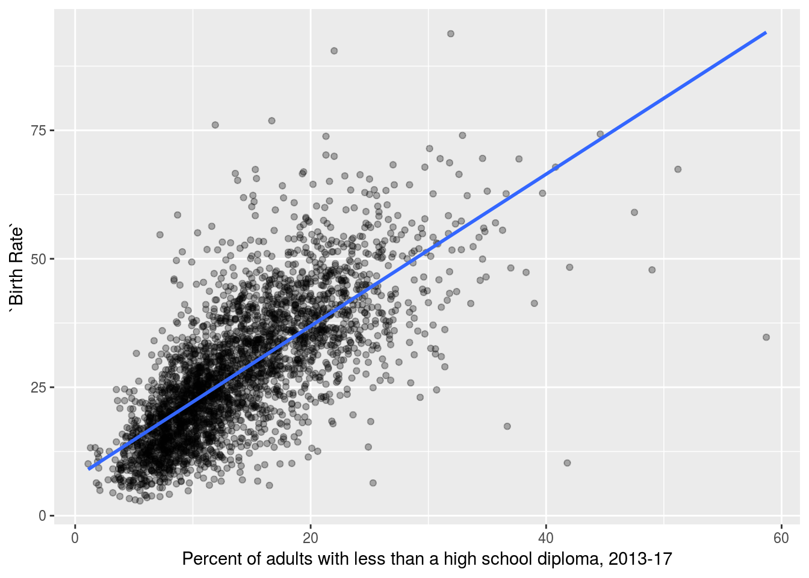

```
## Warning: Removed 2 rows containing non-finite values (stat_smooth).

## Warning: Removed 2 rows containing missing values (geom_point).
```

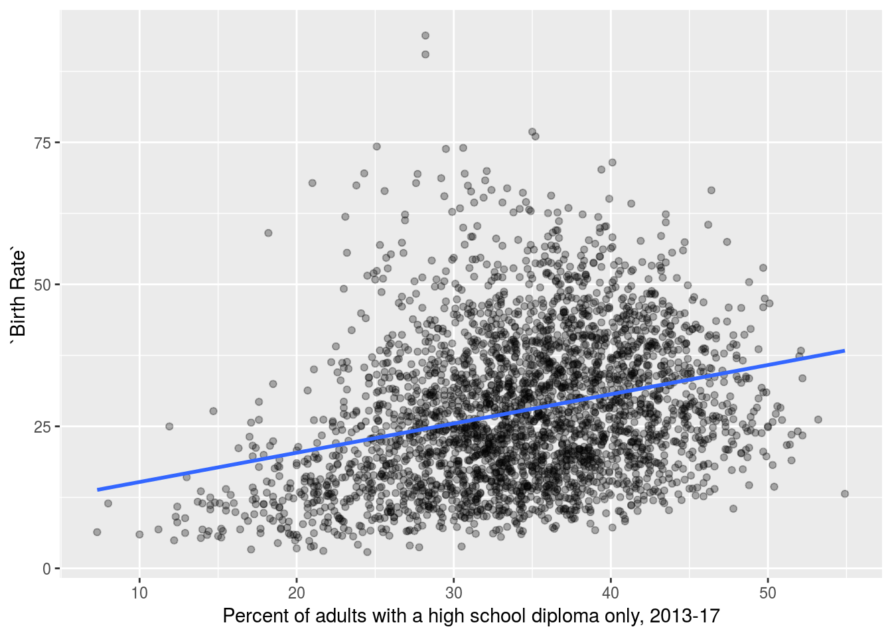

```
## Warning: Removed 2 rows containing non-finite values (stat_smooth).

## Warning: Removed 2 rows containing missing values (geom_point).
```

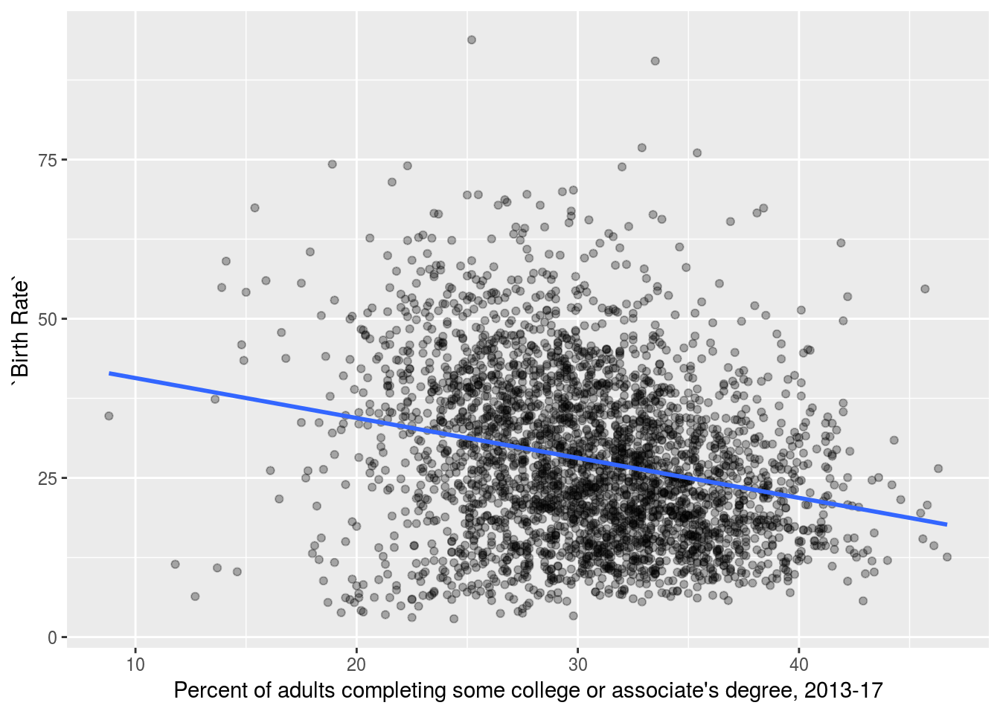

```
## Warning: Removed 2 rows containing non-finite values (stat_smooth).

## Warning: Removed 2 rows containing missing values (geom_point).
```

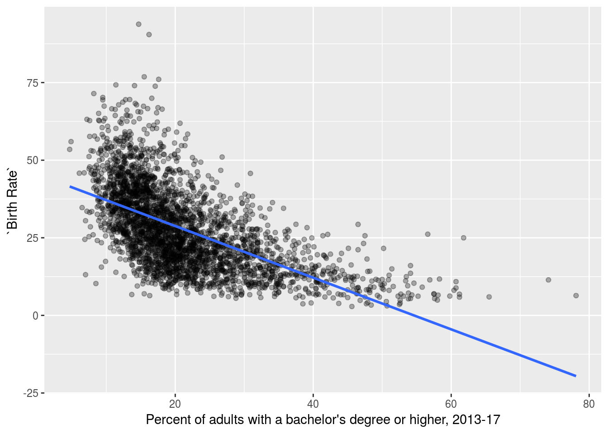

```
## Warning: Removed 2 rows containing non-finite values (stat_smooth).

## Warning: Removed 2 rows containing missing values (geom_point).
```

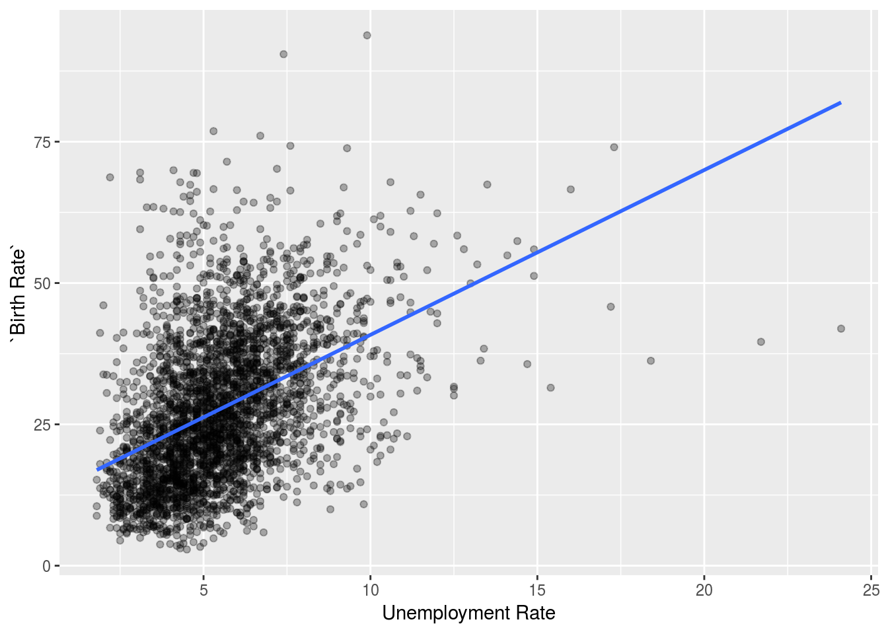

# Linear model of birth rate as a function of unemployment rate and education
The education data divides the population into four groups: less than high school, high school, college, beyond college. Since the four categories add up to 100%, it is sufficient to only include three of the four rates in the linear model.


```
## 
## Call:
## lm(formula = `Birth Rate` ~ UnemploymentRate + Less_than_high_school + 
##     high_school + college, data = data)
## 
## Residuals:
##     Min      1Q  Median      3Q     Max 
## -50.624  -5.317  -0.643   4.622  49.176 
## 
## Coefficients:
##                       Estimate Std. Error t value Pr(>|t|)    
## (Intercept)           28.31067    2.23906  12.644  < 2e-16 ***
## UnemploymentRate       0.68262    0.08822   7.738 1.35e-14 ***
## Less_than_high_school  1.01869    0.03475  29.316  < 2e-16 ***
## high_school           -0.23215    0.03749  -6.193 6.69e-10 ***
## college               -0.48924    0.03492 -14.011  < 2e-16 ***
## ---
## Signif. codes:  0 '***' 0.001 '**' 0.01 '*' 0.05 '.' 0.1 ' ' 1
## 
## Residual standard error: 8.514 on 3128 degrees of freedom
##   (2 observations deleted due to missingness)
## Multiple R-squared:  0.5801,	Adjusted R-squared:  0.5796 
## F-statistic:  1080 on 4 and 3128 DF,  p-value: < 2.2e-16
```

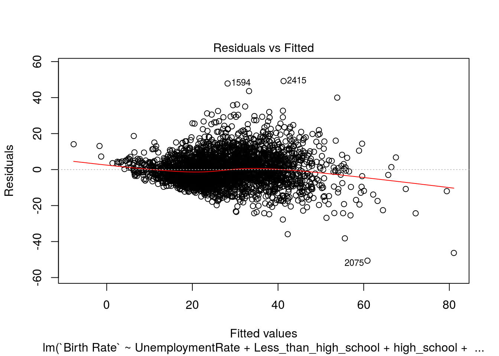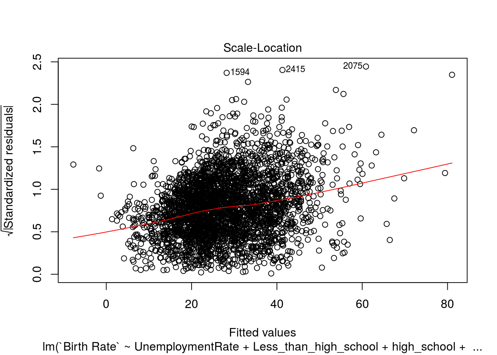

# Linear model of log(birth rate) as a function of unemployment rate and education


# Adding in quadratic terms to the model


# Adding in squareroot terms to the model


# Using log of the independent variables


# Using education and employment to predict square root of birth rate


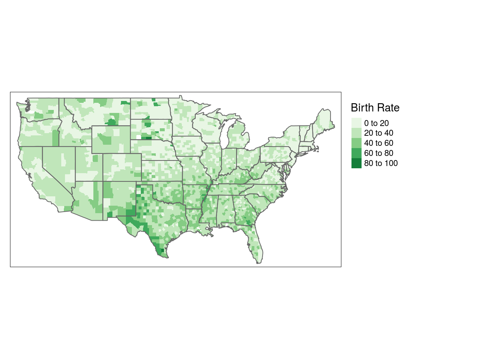


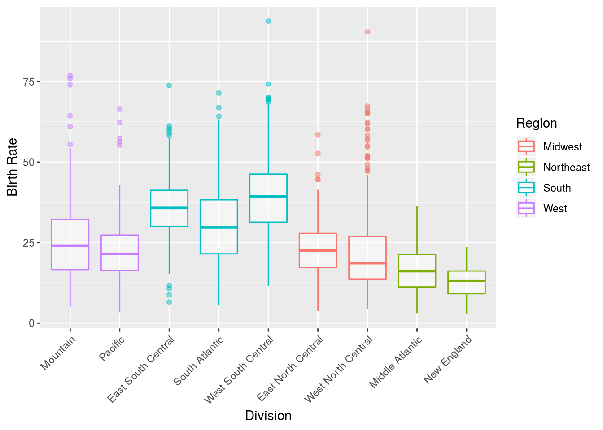


```
## 
## Call:
## lm(formula = `Birth Rate` ~ UnemploymentRate + Less_than_high_school + 
##     high_school + college + Region, data = data)
## 
## Residuals:
##     Min      1Q  Median      3Q     Max 
## -42.623  -5.341  -0.588   4.455  53.584 
## 
## Coefficients:
##                       Estimate Std. Error t value Pr(>|t|)    
## (Intercept)           27.59481    2.38614  11.565  < 2e-16 ***
## UnemploymentRate       0.61385    0.08798   6.977 3.67e-12 ***
## Less_than_high_school  0.80832    0.03904  20.706  < 2e-16 ***
## high_school           -0.18392    0.04005  -4.593 4.55e-06 ***
## college               -0.48397    0.03724 -12.995  < 2e-16 ***
## RegionNortheast       -3.49239    0.65989  -5.292 1.29e-07 ***
## RegionSouth            4.99573    0.40216  12.422  < 2e-16 ***
## RegionWest             1.45183    0.50883   2.853  0.00436 ** 
## ---
## Signif. codes:  0 '***' 0.001 '**' 0.01 '*' 0.05 '.' 0.1 ' ' 1
## 
## Residual standard error: 8.187 on 3125 degrees of freedom
##   (2 observations deleted due to missingness)
## Multiple R-squared:  0.612,	Adjusted R-squared:  0.6112 
## F-statistic: 704.3 on 7 and 3125 DF,  p-value: < 2.2e-16
```

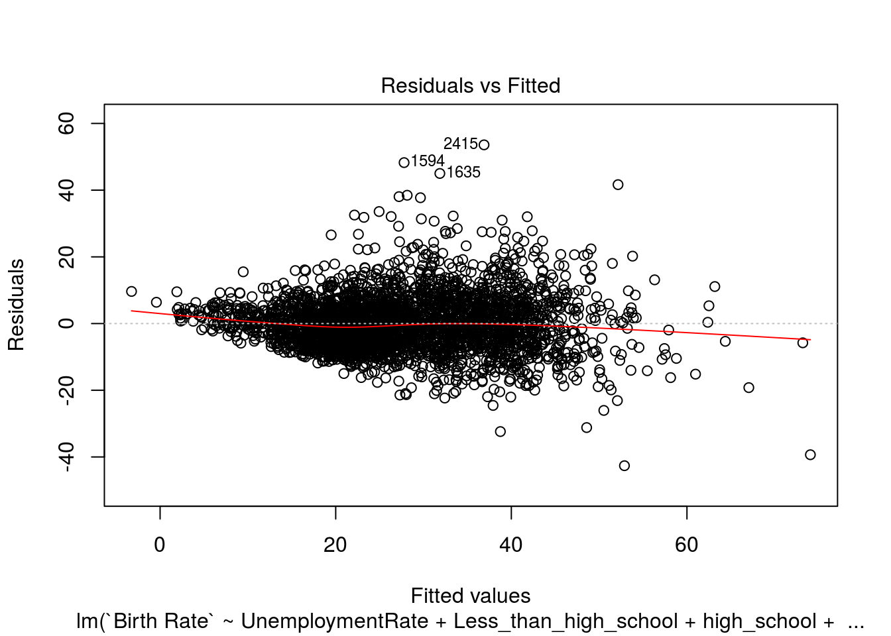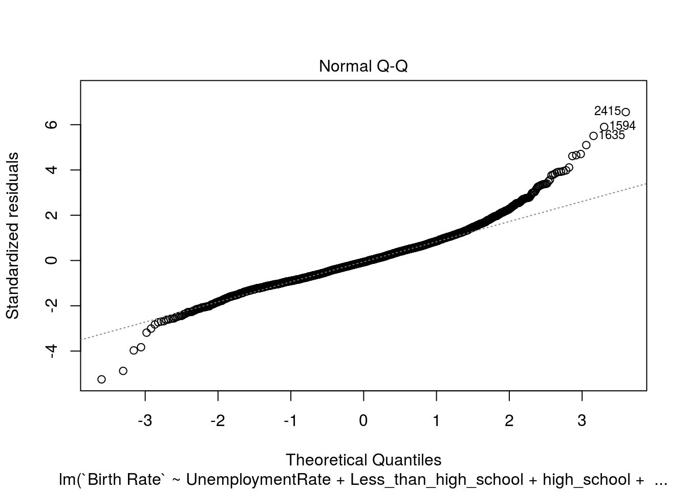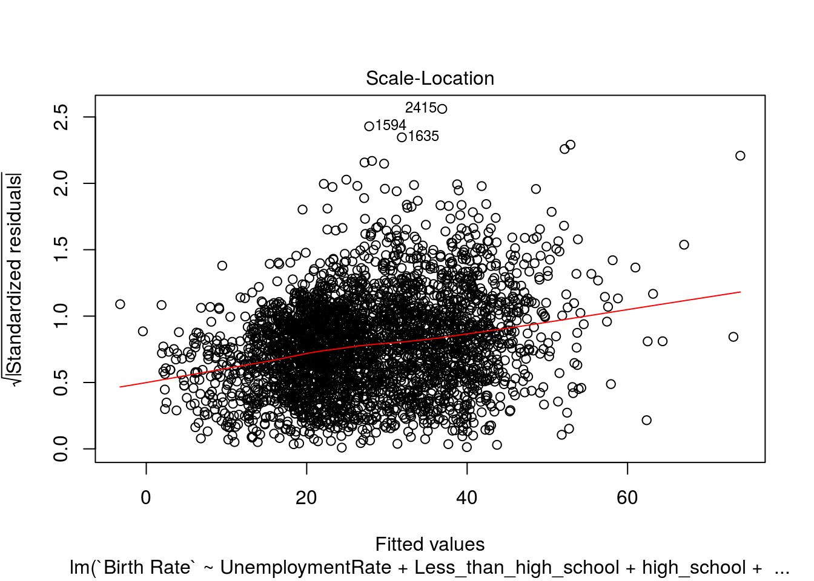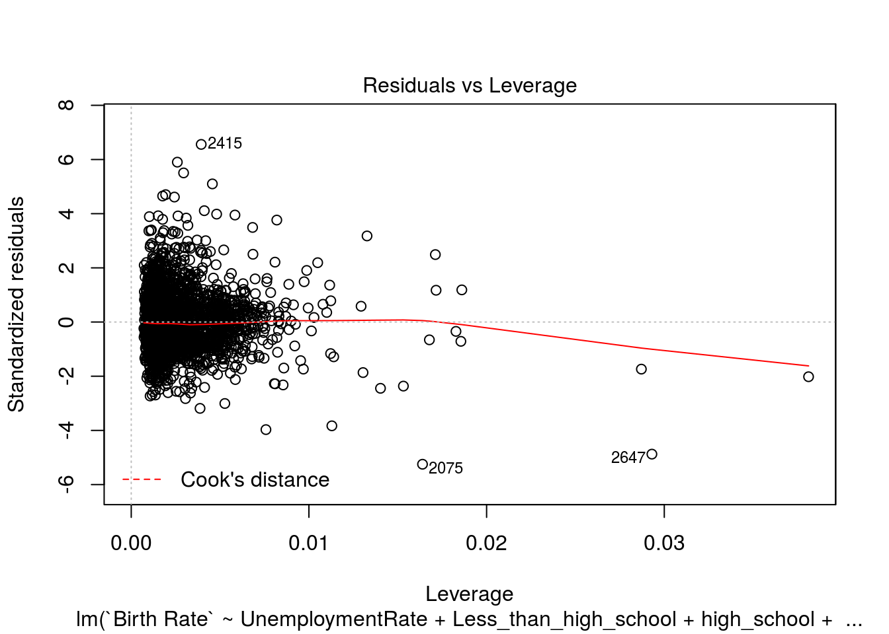
